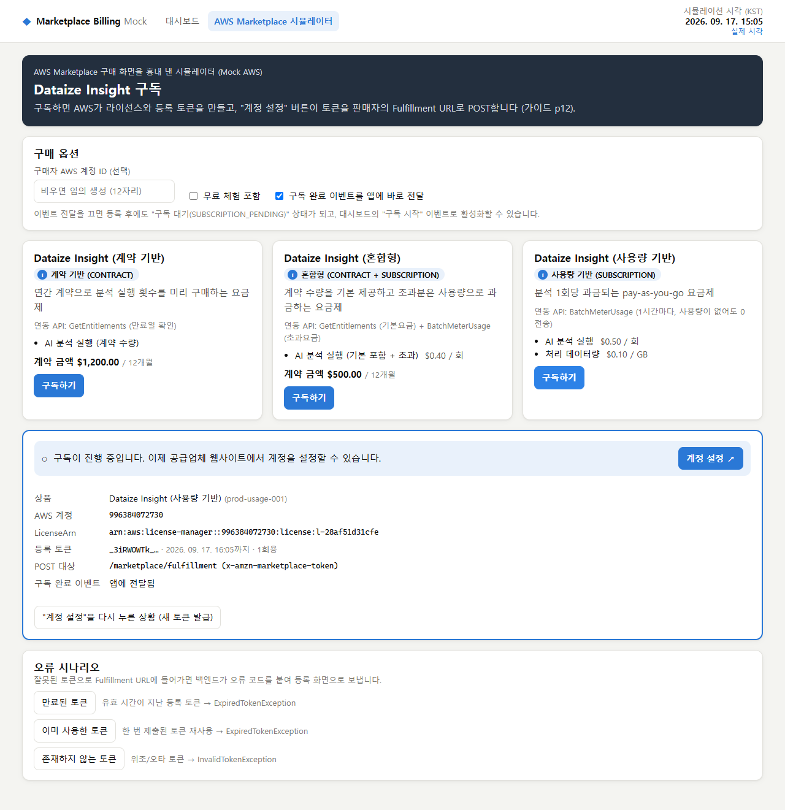
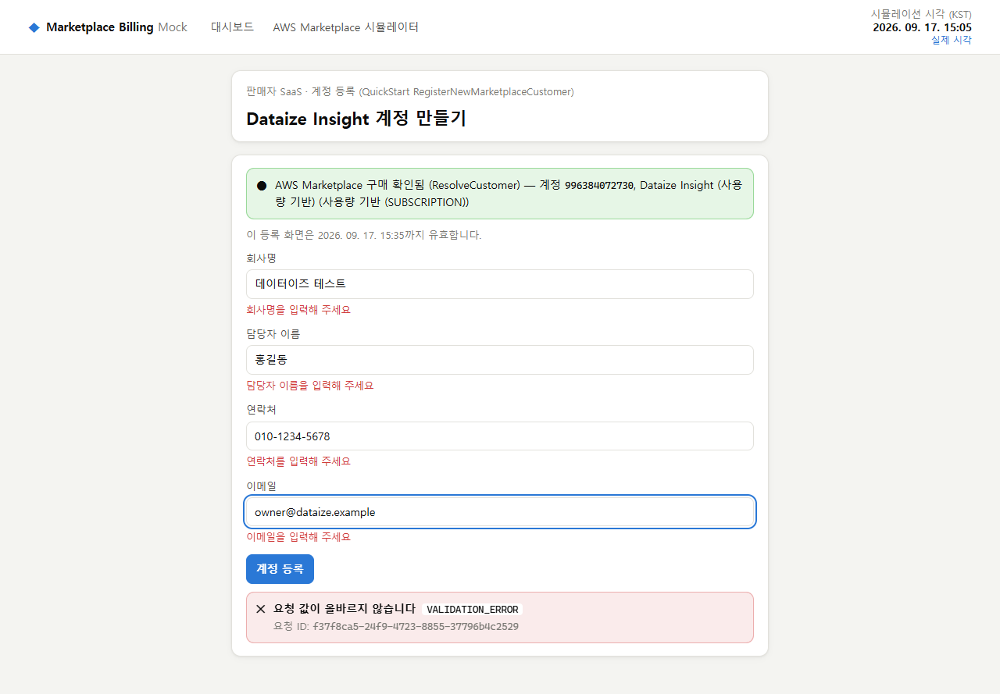
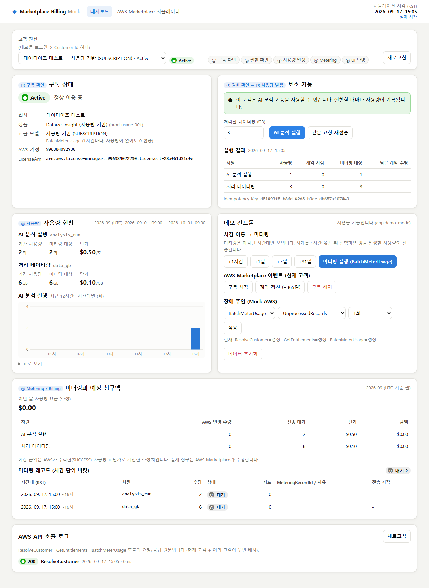
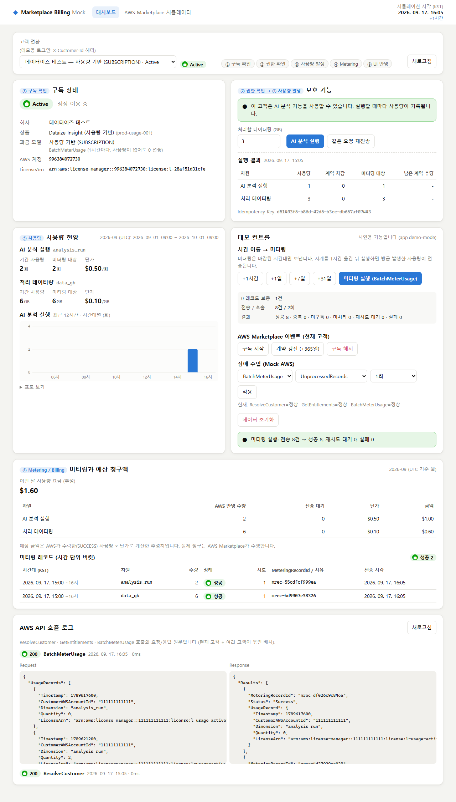
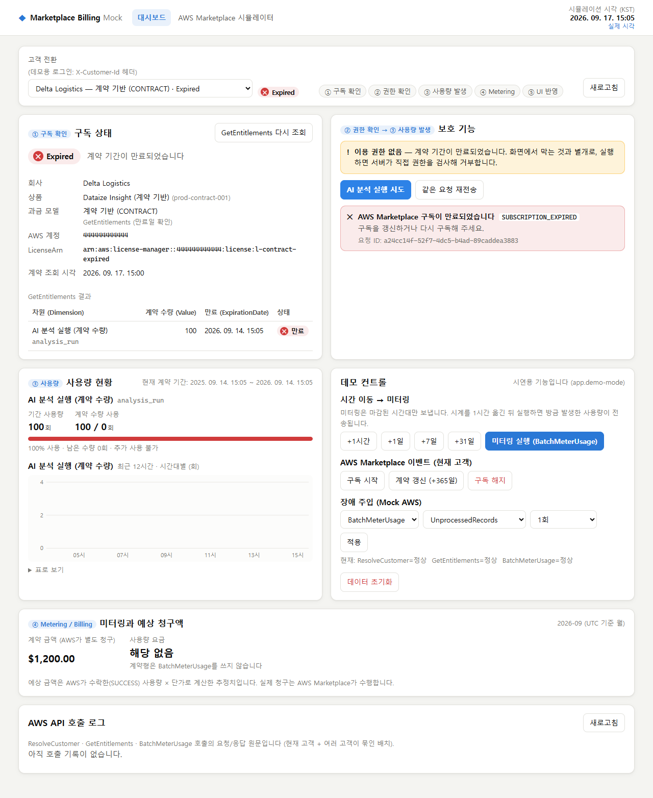
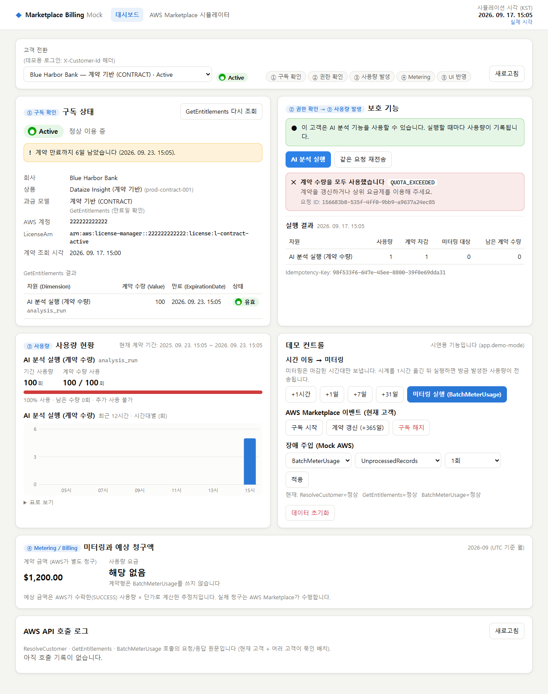
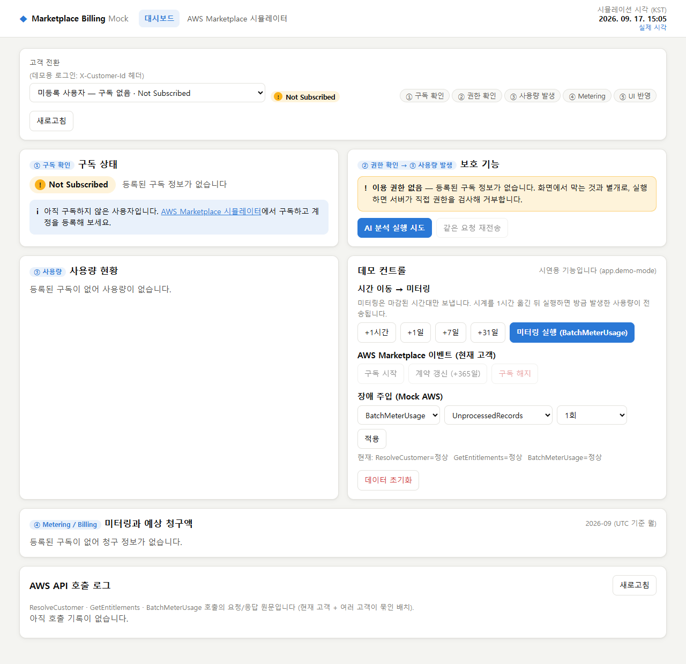
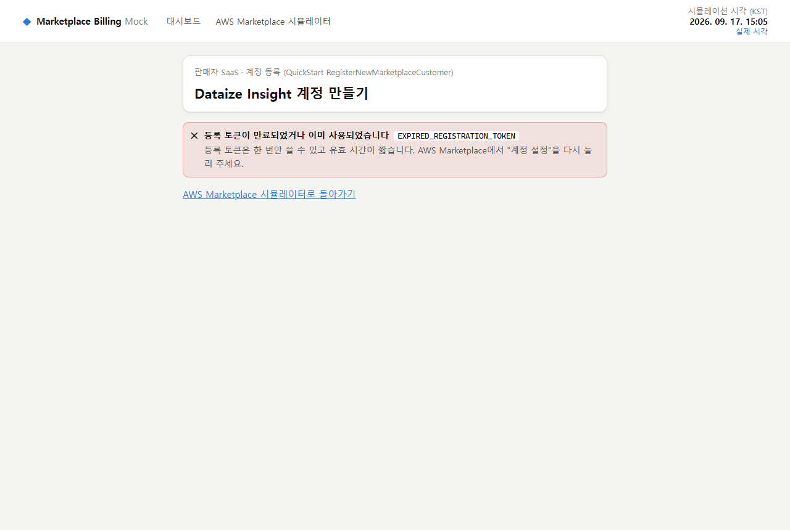
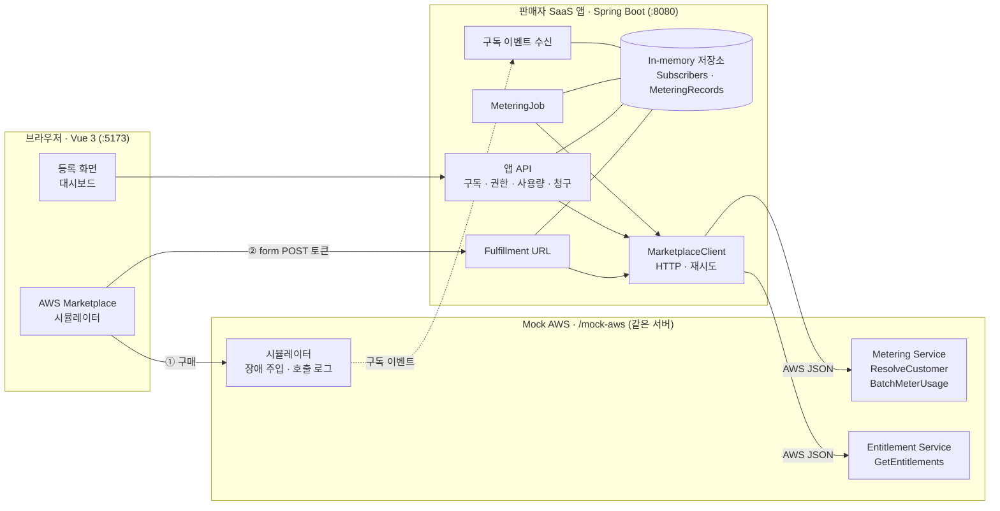
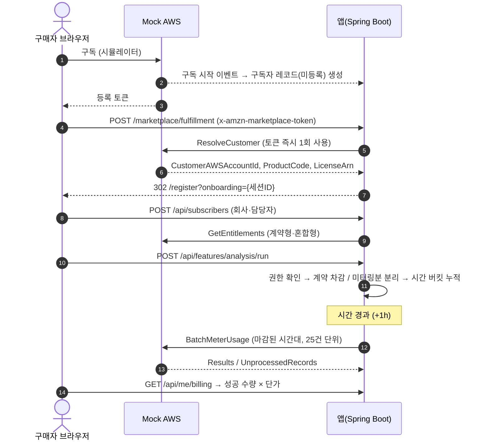

# AWS Marketplace Billing Mock

AWS Marketplace SaaS 연동 흐름을 **실제 AWS 대신 Mock AWS API**로 구현한 과제입니다. 흐름은 `Fulfillment URL → ResolveCustomer → GetEntitlements → BatchMeterUsage` 순서이고, **구독 상태에 따른 접근 제어**부터 **시간 단위 미터링과 청구 반영**까지 Spring Boot와 Vue 3로 연결했습니다.

```
구독 정보 확인 → 사용 권한 확인 → 사용량 발생 → Billing/Metering 처리 → UI 반영
 (Fulfillment,     (상태 계산 +      (계약 차감 /      (시간 버킷 →          (대시보드)
  GetEntitlements)  403/503)          초과분 분리)       BatchMeterUsage)
```

| | |
|---|---|
| 스택 | Spring Boot 4.1 (Java 17, Gradle) · Vue 3.5 + TypeScript + Vite · Playwright |
| 참고 문서 | 제공된 "AWS MarketPlace API Document"의 첨부 가이드 p6~17 (설계 참고: QuickStart p19~23) |
| 테스트 | 백엔드 **96개** (단위 + 실제 HTTP 통합) · 브라우저 E2E **6개** |
| 결과물 | 소스 · README · Mock Data(`backend/src/main/resources/mock-data`) · Mock API(`/mock-aws/**`) · [스크린샷](#스크린샷) · [실행 영상 (1분 41초)](docs/demo.webm) |

---

## 과제 요구사항과 구현 위치

| 요구사항 | 구현 내용 | 주요 코드 |
|---|---|---|
| 구독 정보 Mock Data 설계 | AWS가 가진 데이터(라이선스·계약·토큰)와 판매자가 가진 데이터(구독자·사용량·미터링 레코드)를 분리. 시각은 `now+6d`처럼 상대 표기로 적어 언제 실행해도 시나리오가 유지됨 | [`mock-data/aws`](backend/src/main/resources/mock-data/aws), [`mock-data/app`](backend/src/main/resources/mock-data/app) |
| 구독 상태에 따른 접근 권한 | `ACTIVE` / `EXPIRED` / `NOT_SUBSCRIBED`와 **사유 코드**를 순수 함수로 계산하고, 보호 기능은 403(권한 없음) 또는 503(계약 확인 불가)으로 차단 | `SubscriptionStatusCalculator`, `EntitlementGuard` |
| 사용량/Billing Mock 생성·관리 | 사용량 이벤트 → 계약 차감분과 미터링분으로 분리 → (라이선스, 차원, 시간) 버킷 → BatchMeterUsage → 예상 청구액 | `UsageService`, `MeteringJob`, `BillingService` |
| Backend API ↔ Frontend 연동 | REST API와 공통 오류 형식, 프론트는 Vite 프록시로 호출 | `frontend/src/api/*` |
| 구독 상태·사용량 UI | 대시보드(상태, 보호 기능, 사용량 차트, 미터링 이력, AWS 호출 로그), Marketplace 시뮬레이터, 등록 화면 | `frontend/src/views/*` |
| 오류 및 예외 처리 | 오류 코드 체계, AWS 예외 → 앱 오류 변환, 지수 백오프 재시도, 장애 주입으로 재현 가능 | `ErrorCode`, `HttpMarketplaceClient`, `MockAwsFaults` |
| 구조와 실행 방법 정리 | 이 문서, 설계 문서 [docs/PLAN.md](docs/PLAN.md) | |

---

## 실행 방법

**필요 환경**: JDK 17 이상, Node.js 20 이상. E2E 테스트는 PC에 설치된 Chrome을 사용합니다. Gradle은 wrapper가 자동으로 내려받습니다.

```bash
git clone https://github.com/fdrn9999/aws-marketplace-billing-mock.git
cd aws-marketplace-billing-mock
npm run setup      # 루트 + frontend 의존성 설치
npm run dev        # 백엔드(:8080) + 프론트엔드(:5173) 동시 실행
```

브라우저에서 **http://localhost:5173** 을 열면 됩니다. 처음 실행할 때는 Gradle과 의존성을 내려받느라 1~2분 걸릴 수 있습니다.

| 명령 | 내용 |
|---|---|
| `npm test` | 백엔드 테스트 (JUnit 5, 실제 포트로 서버를 띄워 HTTP로 검증) |
| `npm run e2e` | Playwright 브라우저 테스트 (서버가 꺼져 있으면 자동 기동) + 스크린샷 갱신 |
| `npm run build` | 백엔드 jar + 프론트엔드 정적 빌드 |
| `npm run demo:video` | 데모 영상 다시 녹화 → `docs/demo.webm` (커서·자막 표시) |
| `npm run dev:api` / `npm run dev:web` | 백엔드 / 프론트엔드만 따로 실행 |

- 백엔드만 실행할 때: `cd backend && ./gradlew bootRun` (Windows는 `gradlew.bat bootRun`)
- Chrome이 없으면 `npx playwright install chromium` 후 `PW_CHANNEL=bundled npm run e2e`로 실행합니다.
- 데이터는 메모리에만 저장됩니다. 서버를 재시작하거나 대시보드의 **데이터 초기화**를 누르면 시드 상태로 돌아갑니다.

---

## 3분 데모 시나리오

대시보드 상단의 **고객 전환**은 데모용 로그인입니다(`X-Customer-Id` 헤더). 시드 고객마다 상태가 다릅니다.

| 고객 | 과금 모델 | 시작 상태 | 보여주는 것 |
|---|---|---|---|
| Acme Analytics | 사용량 기반 | Active | 전량 미터링, 대기/성공 레코드, 0 사용량 보충 |
| Blue Harbor Bank | 계약 기반 (100회) | Active, 95회 사용, **만료 6일 전** | 만료 임박 경고, 한도 초과 403 |
| Cobalt Retail | 혼합형 (포함 50회) | Active, 포함량 초과 | 초과분만 미터링 |
| Delta Logistics | 계약 기반 | **Expired** (3일 전 만료) | 기능 차단, 갱신 이벤트로 복구 |
| Foxtrot Media | 사용량 기반 | **Expired** (해지) | 해지 사유 표시 |
| Echo Health | 사용량 기반 | **Not Subscribed** (구독 이벤트 대기) | 등록과 구독 완료 이벤트의 순서 문제 |
| 미등록 사용자 | - | **Not Subscribed** | 구독 유도 |

1. **접근 제어**: *Blue Harbor Bank*에서 "AI 분석 실행"을 5번 누르고 6번째에 `QUOTA_EXCEEDED`를 확인합니다. *Delta Logistics*에서 실행하면 `SUBSCRIPTION_EXPIRED`가 나오고, 데모 컨트롤의 **계약 갱신(+365일)** 을 누르면 Active로 돌아옵니다.
2. **온보딩**: 상단 **AWS Marketplace 시뮬레이터**에서 상품을 **구독하기** → **계정 설정**(실제 form POST) → 등록 폼 → **이 고객으로 대시보드 보기**.
3. **사용량 → 미터링**: 분석을 몇 번 실행하고 **+1시간** → **미터링 실행**을 누릅니다. 미터링 레코드가 `대기 → 성공`으로 바뀌고, 예상 청구액과 **AWS API 호출 로그**(요청/응답 원문)가 갱신됩니다.
4. **장애 대응**: 장애 주입에서 `BatchMeterUsage` / `UnprocessedRecords`를 적용하고 미터링을 실행하면 "재시도 대기"가 됩니다. 해제하고 다시 실행하면 성공합니다. `GetEntitlements` / `InternalServiceError`(계속)를 켜고 **+1일**을 누르면, 계약형 고객이 계약 확인 불가로 차단(503)됩니다.
5. **토큰 오류**: 시뮬레이터 하단의 오류 시나리오(만료, 재사용, 위조 토큰)를 누르면 등록 화면에 오류 코드와 안내가 나옵니다.
6. **시간 경과**: *Blue Harbor Bank*에서 **+7일**을 누르면 계약이 만료되어 `EXPIRED / CONTRACT_EXPIRED`가 됩니다.

---

## 스크린샷

| | |
|---|---|
|  **① 구독 → 계정 설정** (시뮬레이터) |  **② ResolveCustomer 후 계정 등록** |
|  **③ 보호 기능 실행 → 사용량 기록** |  **④ +1시간 → BatchMeterUsage → 청구 반영, 호출 로그** |
|  **Expired: 403 SUBSCRIPTION_EXPIRED** |  **계약 한도 초과: 403 QUOTA_EXCEEDED** |
|  **Not Subscribed** |  **만료된 등록 토큰** |

**실행 영상 (1분 41초)**: [docs/demo.webm](docs/demo.webm) — 빨간 원이 마우스 커서이고, 하단 자막이 지금 보고 있는 단계(① 구독 확인 → ⑤ UI 반영)를 알려 줍니다. 만료 고객 차단 → 계약 갱신 → Marketplace 구독·등록 → 사용 → +1시간 → 미터링 → 청구 반영 → 계약 한도 초과 순서입니다.

스크린샷은 `npm run e2e`, 영상은 `npm run demo:video`로 다시 만들 수 있습니다.

---

## 아키텍처



- 앱은 **`MarketplaceClient` 인터페이스로만** AWS에 접근합니다. Mock AWS가 같은 프로세스 안에 있어도 HTTP로 호출하므로 네트워크 오류, 재시도, AWS 오류 해석 경로가 실제 연동과 같은 모양입니다.
- Mock AWS의 요청과 응답은 가이드 p13/p16/p17의 JSON 형식(PascalCase, 시각은 epoch 초)을 따르고, 오류는 AWS JSON 프로토콜처럼 `{"__type": "InvalidTokenException", "message": ...}`로 돌려줍니다.
- 모든 시간 규칙은 **시뮬레이션 시계**(`SimulatedClock`, 앞으로만 이동)를 기준으로 합니다. 시간 단위 미터링과 계약 만료를 기다리지 않고 시연하기 위해서입니다.

### 온보딩 → 미터링 시퀀스



---

## 가이드의 과금 모델과 API 대응

| 과금 모델 (가이드 p8, p15) | 사용하는 AWS API | 이 프로젝트의 동작 |
|---|---|---|
| **SUBSCRIPTION** (사용량 기반) | BatchMeterUsage (1시간마다, 사용량이 없어도 0 전송) | 사용량 전량을 시간 버킷에 누적. 사용량이 없는 마감 시간대에는 0 레코드를 보충해 전송 |
| **CONTRACT** (계약 기반) | GetEntitlements (만료일 확인) | 계약 수량 안에서만 허용(초과 시 403). 만료일이 지나면 EXPIRED. 미터링 없음 |
| **CONTRACT + SUBSCRIPTION** (혼합형) | GetEntitlements (기본요금) + BatchMeterUsage (초과요금) | `포함분 = min(요청량, 남은 계약 수량)`, `초과분 = 요청량 − 포함분`. 초과분만 미터링 |

---

## 데이터 모델 (Mock Data)

**AWS 측 데이터** (`mock-data/aws/`, AWS만 아는 정보)

| 파일 | 내용 |
|---|---|
| `listings.json` | 상품별 과금 모델, 미터링 차원, 계약 차원(수량·기간) |
| `licenses.json` | 구매 1건 = 라이선스 1개 (`licenseArn`, `customerAWSAccountId`, 상태 `ACTIVE`/`CANCELLED`) |
| `entitlements.json` | 가이드 p17 형식의 계약 정보 (`Dimension`, `Value.IntegerValue`, `ExpirationDate`) |
| `registration-tokens.json` | 오류 시나리오용 토큰(만료, 사용 완료). 정상 토큰은 구매할 때 발급 |

**판매자(앱) 측 데이터** (`mock-data/app/`)

| 엔티티 | 주요 필드 | 참고 |
|---|---|---|
| `Product` | `productCode`, `pricingModel`, `dimensions[]`(단가) | 가이드 p8 |
| `Subscriber` | `licenseArn`(유니크), `customerAWSAccountId`, 회사·담당자, `successfullyRegistered`, `successfullySubscribed`, `subscriptionExpired`, `entitlements[]`, `termStartAt`, `lastEntitlementSyncAt` | QuickStart `AWSMarketplaceSubscribers` (p21~22) |
| `UsageEvent` | `quantity`, `includedQuantity`(계약 차감), `meteredQuantity`(미터링), `idempotencyKey` | |
| `MeteringRecord` | 유니크 `(licenseArn, dimension, hourStart)`, `quantity`, `status`, `meteringRecordId`, `attempts`, `lastError` | QuickStart `AWSMarketplaceMeteringRecords` (p23). 전송 후에도 삭제하지 않고 이력으로 보관 |

미터링 레코드 시드는 따로 두지 않고 **사용량 이벤트를 합산해 생성**합니다. 그래서 두 데이터가 어긋나지 않습니다.

---

## 구독 상태와 접근 권한

상태는 위에서부터 먼저 걸리는 규칙으로 정합니다 (`SubscriptionStatusCalculator`, 규칙표 테스트 14개).

| # | 조건 | 상태 | 사유 |
|---|---|---|---|
| 1 | 구독자 레코드 없음 | NOT_SUBSCRIBED | `NOT_REGISTERED` |
| 2 | 해지됨 / AWS가 사용량 보고를 거부함 | EXPIRED | `UNSUBSCRIBED` / `METERING_REJECTED` |
| 3 | 등록했지만 구독 완료 이벤트 미수신 | NOT_SUBSCRIBED | `SUBSCRIPTION_PENDING` |
| 4 | 계약형인데 계약 정보를 신뢰할 수 없음 | NOT_SUBSCRIBED | `ENTITLEMENT_UNVERIFIED` (fail-closed) |
| 5 | 계약형인데 유효한 Entitlement가 없음 | EXPIRED | `CONTRACT_EXPIRED` |
| 6 | 그 외 | ACTIVE | `ENTITLED` |

| 상태 · 모델 | 보호 기능 | 응답 |
|---|---|---|
| ACTIVE · 사용량 기반 | 허용, 전량 미터링 | 200 |
| ACTIVE · 계약 기반 | 계약 수량까지 허용 | 초과 시 403 `QUOTA_EXCEEDED` |
| ACTIVE · 혼합형 | 허용, 초과분만 미터링 | 200 (`overage: true`) |
| EXPIRED | 차단 (조회는 가능) | 403 `SUBSCRIPTION_EXPIRED` + `details.reason` |
| NOT_SUBSCRIBED | 차단 | 403 `NOT_SUBSCRIBED` + `details.reason` |
| 계약 확인 불가 (GetEntitlements 장애 + 캐시 사용 불가) | 차단 | 503 `ENTITLEMENT_UNAVAILABLE` + `Retry-After` |
| 고객 식별 불가 | 차단 | 401 `UNAUTHENTICATED` |

- **계약 정보 캐시**: 15분이 지나면 조회할 때 GetEntitlements로 다시 동기화합니다. 동기화에 실패해도 **마지막 확인이 24시간 이내**면 캐시로 판단하고 화면에 `stale`로 표시합니다. 한 번도 확인하지 못했거나 24시간을 넘기면 차단합니다.
- **원자성**: "구독 상태 재확인 → 남은 수량 확인 → 사용량 기록 → 버킷 누적"은 구독(licenseArn) 단위 락 안에서 한 번에 처리합니다. 동시 요청이 몰려도 계약 수량을 넘지 않고, 권한 확인 직후 해지 이벤트가 끼어들어도 사용량이 기록되지 않습니다.
- **이벤트 순서**: SQS는 순서를 보장하지 않으므로, 이미 반영한 이벤트보다 먼저 발생한 이벤트는 무시합니다(`ignored: true`). 해지 뒤 다시 구독하면 새 계약 기간으로 보고 사용량을 0부터 셉니다.
- **Idempotency-Key**: 같은 키와 같은 내용으로 다시 보내면 저장해 둔 결과를 돌려주고(`replayed: true`, 중복 차감 없음), 같은 키에 다른 내용이면 409를 반환합니다.

---

## Metering 처리 규칙 (`MeteringJob`)

1. **0 사용량 보충** (가이드 p15): Active인 사용량 기반 구독에서 마감된 시간대(최근 3시간)에 레코드가 없으면 대표 차원으로 수량 0 레코드를 만듭니다.
2. **대상 선정**: `hourStart + 1h ≤ now`인 **마감된 시간대**의 PENDING만 보냅니다. 현재 시간대는 사용량이 계속 쌓이므로 보내지 않습니다.
3. **24시간 사전 차단** (AWS): 24시간 이상 지난 레코드는 요청 전체를 실패시키는 `TimestampOutOfBoundsException`을 부르므로, 보내지 않고 `FAILED`로 처리합니다.
4. **전송**: 상품별로 묶어 **25건씩** BatchMeterUsage를 호출합니다. 신규 연동 규칙에 따라 `LicenseArn` + `CustomerAWSAccountId`로 보내고, 요청 레벨 `ProductCode`는 넣지 않습니다.
5. **결과 반영**

   | 응답 | 처리 |
   |---|---|
   | `Success` | `SUCCESS` + `MeteringRecordId` 저장. 다시 보내지 않음 |
   | `DuplicateRecord` (같은 시간대에 다른 수량이 이미 보고됨) | `DUPLICATE`로 종료. 반영되지 않았으므로 조사 대상 |
   | `CustomerNotSubscribed` | `FAILED` + 구독을 `EXPIRED / METERING_REJECTED`로 전환 |
   | `UnprocessedRecords` | `PENDING`으로 되돌려 다음 실행에서 재시도. 5회를 넘기면 `FAILED` |
   | Throttling / 5xx | 호출 단위로 지수 백오프 재시도(3회). 그래도 실패하면 `PENDING` 유지 |
   | 재시도해도 안 되는 요청 오류 | 한 건씩 다시 보내 **문제 레코드만** `FAILED` 처리 (나머지는 정상 전송) |
6. **동시 실행 방지와 복구**: 실행 중에 다시 요청하면 409 `METERING_ALREADY_RUNNING`. 예상하지 못한 예외가 나도 전송 중(SENDING)이던 레코드는 PENDING으로 되돌아가고, AWS 수량 범위(int)를 넘는 레코드는 보내기 전에 `FAILED` 처리합니다.
7. **실행 방식**: 데모에서는 대시보드 버튼으로 수동 실행합니다. `app.metering.auto-run-interval`을 설정하면 주기 실행합니다(QuickStart의 EventBridge Hourly 역할).
8. **예상 청구액**: 이번 달(UTC) `SUCCESS` 수량 × 단가로 계산한 추정치입니다. 실제 청구는 AWS Marketplace가 합니다.

---

## API

### 앱 API

| Method · Path | 설명 |
|---|---|
| `POST /marketplace/fulfillment` | **Fulfillment URL**. form 필드 `x-amzn-marketplace-token`을 받아 즉시 ResolveCustomer → `302 /register?onboarding={id}`. 실패하면 `302 /register?error={코드}` |
| `GET /api/onboarding/{id}` | 등록 화면용 조회 결과 (AWS 계정, 상품, 이미 등록됐는지) |
| `POST /api/subscribers` | 계정 등록 (검증 포함) → 구독자 저장 → 계약형이면 GetEntitlements |
| `GET /api/me/subscription` | 현재 구독 상태, 사유, 계약 정보, 만료 임박, stale 여부 |
| `POST /api/me/subscription/refresh` | GetEntitlements 즉시 재조회 |
| `POST /api/features/analysis/run` | **보호 기능**. `Idempotency-Key` 헤더 지원, body `{ "dataGb": 1~100 }` |
| `GET /api/me/usage` | 기간별 차원 사용량, 계약 대비 사용률, 최근 12시간 추이 |
| `GET /api/me/billing` | 미터링 레코드 이력, 상태별 건수, 이번 달 예상 청구액 |
| `GET /api/products` | 판매 상품 목록 |
| `POST /api/internal/marketplace-events` | 구독 이벤트 수신 (공유 비밀값 헤더 필요) |
| `GET /api/customers` ※ | 데모 고객 목록 |
| `GET·POST /api/admin/clock` ※ | 시뮬레이션 시계 조회 / 이동 (`{"advance":"1h"}`, 앞으로만, 최대 400일) |
| `POST /api/admin/metering/run` ※ | 미터링 작업 실행 → 결과 요약 |
| `POST /api/admin/reset` ※ | 시계와 모든 데이터를 시드 상태로 초기화 |

※ 데모 전용이며 `app.demo-mode=false`면 등록되지 않습니다. `/api/me/**`와 `/api/features/**`는 `X-Customer-Id` 헤더가 필요합니다.

오류 응답은 모두 `{ "error": { "code", "message", "details", "requestId" } }` 형식입니다.

| HTTP | code |
|---|---|
| 400 | `VALIDATION_ERROR`(필드별 `details.fields`), `INVALID_REGISTRATION_TOKEN`, `EXPIRED_REGISTRATION_TOKEN`, `ONBOARDING_SESSION_EXPIRED`, `UNKNOWN_PRODUCT`, `INVALID_CLOCK_OPERATION` |
| 401 | `UNAUTHENTICATED` |
| 403 | `NOT_SUBSCRIBED`, `SUBSCRIPTION_EXPIRED`, `QUOTA_EXCEEDED` |
| 404 | `NOT_FOUND` |
| 409 | `METERING_ALREADY_RUNNING`, `IDEMPOTENCY_KEY_CONFLICT`, `DEMO_BUSY`(진행 중인 요청 때문에 초기화 대기 시간 초과) |
| 503 | `MARKETPLACE_UNAVAILABLE`, `ENTITLEMENT_UNAVAILABLE` (`Retry-After` 포함) |

### Mock AWS API (`/mock-aws/**`)

| Path | AWS API | 요청 → 응답 | 오류 (`__type`) |
|---|---|---|---|
| `POST /mock-aws/metering/resolve-customer` | ResolveCustomer | `{RegistrationToken}` → `{CustomerIdentifier, CustomerAWSAccountId, ProductCode, LicenseArn}` | `InvalidTokenException`, `ExpiredTokenException`(만료 또는 **재제출**), `ThrottlingException` |
| `POST /mock-aws/entitlement/get-entitlements` | GetEntitlements | `{ProductCode, Filter, NextToken, MaxResults}` → `{Entitlements[], NextToken}` | `InvalidParameterException`, `ThrottlingException`, `InternalServiceErrorException` |
| `POST /mock-aws/metering/batch-meter-usage` | BatchMeterUsage | `{UsageRecords[≤25, 한 제품]}` → `{Results[], UnprocessedRecords[]}` | `TimestampOutOfBoundsException`, `InvalidLicenseException`, `InvalidUsageDimensionException`, `InvalidProductCodeException`, `ThrottlingException` |
| `POST /mock-aws/_sim/purchase` · `/tokens` · `/events` | (시뮬레이터) | 구매 / 토큰 재발급 / 구독 시작·계약 갱신·해지 이벤트 | |
| `GET·PUT /mock-aws/_sim/faults`, `GET /mock-aws/_sim/calls` | (시뮬레이터) | 장애 주입 / 호출 로그 | |

실제 AWS는 엔드포인트 하나에 `X-Amz-Target` 헤더로 작업을 구분하지만, 읽기 쉽게 경로로 나눴습니다.

---

## 가이드 예시와 최신 AWS 동작의 차이

제공된 가이드와 함께 **AWS SDK v3 최신 모델**(`@aws-sdk/client-marketplace-metering`, `client-marketplace-entitlement-service` 3.1134.0, 2026-09-16 배포)의 API 문서를 확인했고, 차이가 있는 부분은 아래처럼 처리했습니다.

| 항목 | 가이드 예시 | 최신 AWS (SDK 문서) | 이 프로젝트 |
|---|---|---|---|
| 고객 식별 | `CustomerIdentifier` | 2026-06-01부터 신규 SaaS는 **`CustomerAWSAccountId` + `LicenseArn`** (Concurrent Agreements: 한 계정이 여러 계약 보유 가능) | 구독자 유니크 키를 `licenseArn`으로 하고, `CustomerIdentifier`는 호환용으로만 보관 |
| BatchMeterUsage 요청 | `ProductCode` + 레코드별 `LicenseArn` | LicenseArn 방식이면 요청 레벨 `ProductCode`는 **넣지 않음** | 앱은 넣지 않음. Mock은 가이드 형식(둘 다 있음)도 받아줌 |
| GetEntitlements 필터 키 | `"LicenseArn"` | `LICENSE_ARN`, `CUSTOMER_AWS_ACCOUNT_ID` 등 | 앱은 SDK 키 사용. Mock은 두 표기 모두 허용 |
| 사용량 시각 한도 | (언급 없음) | 이벤트 후 **24시간** 이상 지난 레코드 거부 (월말 6시간 유예) | 24시간 한도 적용, 앱은 보내기 전에 차단 |
| DuplicateRecord | (언급 없음) | 같은 고객·차원·시간에 **다른 수량**이 이미 보고된 경우. 같은 레코드 재전송은 멱등 | 그대로 구현 (시간은 시 단위로 비교) |
| 등록 토큰 | 등록 화면에서 조회 (QuickStart p21) | 받는 즉시 조회해야 함. 재제출하거나 오래 보유하면 `ExpiredTokenException` | Fulfillment URL에서 즉시 조회하고, 등록 화면은 토큰 대신 세션 ID 사용 (토큰이 URL에 남지 않음) |

---

## 가정과 단순화

과제 범위에 맞춰 다음은 단순화하거나 정책으로 정했습니다. 코드에는 `[Mock 정책]`으로 표시했습니다.

- **계약 수량의 의미**: `Value.IntegerValue`를 "계약 기간 동안의 총 실행 가능 횟수"로 해석합니다. 실제 AWS 계약 차원은 좌석 수나 티어 등 상품마다 의미가 다릅니다. 계약 갱신 이벤트(만료일 연장)가 오면 새 계약 기간으로 보고 사용량을 0부터 셉니다.
- **구독 이벤트**: 실제로는 EventBridge 이벤트나 SNS 메시지(`subscribe-success`, `unsubscribe-pending`, `unsubscribe-success`, `entitlement-updated` 등)로 오고 형식이 서로 다릅니다. 여기서는 `SUBSCRIPTION_STARTED` / `ENTITLEMENT_UPDATED` / `SUBSCRIPTION_CANCELLED` 하나의 형식으로 통일해 HTTP로 전달합니다(전달 1회, 재시도 없음). 해지 직전 1시간 안에 남은 사용량을 보내는 유예 처리는 구현하지 않았습니다.
- **UnprocessedRecords**: 실제로는 서비스 측 일시 오류일 때 생깁니다. Mock에서는 장애 주입을 켰을 때만 생깁니다. 재시도 한도(5회)는 정책입니다.
- **요청 단위 검증 오류 이름**: 26건 이상 전송, 여러 제품 혼합, 필수값 누락처럼 SDK 모델에 예외 이름이 명시되지 않은 경우는 `ValidationException`으로 응답합니다.
- **등록 토큰 유효 시간**: 1시간(설정값), 등록 세션은 30분입니다. 실제 값은 AWS가 공개하지 않습니다.
- **0 사용량 보충**: 가이드의 "사용량이 없어도 0 전송"을 사용량 기반 모델에만 적용하고, 최근 3시간까지만 보충합니다(시계를 크게 옮겨도 레코드가 폭증하지 않도록).
- **청구 금액**: 화면 표시용 추정치입니다. 세금, 할인, 비공개 오퍼 등은 고려하지 않습니다.

## 보안과 한계

- **데모 인증**: `X-Customer-Id` 헤더만으로 고객을 식별하므로 누구나 다른 고객으로 위장할 수 있습니다. 실제 서비스에서는 로그인 사용자와 구독자(`licenseArn`)를 매핑해야 합니다.
- 데모 전용 API(`/api/admin/**`, `/api/customers`, `/mock-aws/_sim/**`)는 환경변수 `APP_DEMO_MODE=false`로 끌 수 있습니다.
- 이벤트 수신 API는 공유 비밀값 헤더(`X-Marketplace-Event-Secret`)를 확인한 뒤에만 본문을 해석합니다. 비밀값은 `APP_EVENT_SECRET`으로 주입하며, 데모 모드가 아닌데 저장소에 있는 기본값을 쓰면 **서버가 기동하지 않습니다**.
- **데이터 초기화**는 진행 중인 앱 요청이 끝날 때까지 기다린 뒤 실행합니다(요청은 읽기 잠금, 초기화는 쓰기 잠금). 초기화 전에 읽어 둔 데이터가 초기화 뒤에 다시 저장되는 일이 없습니다.
- 저장소는 메모리입니다. 재시작하면 초기화되고, 락과 멱등 키도 단일 프로세스에서만 유효합니다.
- 오류 응답에는 스택 트레이스나 역직렬화 내부 메시지를 넣지 않고, 추적용 `requestId`(`X-Request-Id` 헤더와 동일)만 넣습니다. 상세 원인은 같은 요청 ID로 서버 로그에 남깁니다.

## 실제 AWS로 전환한다면

| 영역 | 이 프로젝트 | 실제 환경 |
|---|---|---|
| AWS 호출 | `HttpMarketplaceClient` → Mock | `MarketplaceClient`를 AWS SDK for Java v2(`MarketplaceMeteringClient`, `MarketplaceEntitlementClient`)로 구현. 판매자 계정 IAM 역할, us-east-1 |
| Fulfillment URL | Vite 프록시 경유 | 공개 HTTPS 엔드포인트 (리스팅에 등록) |
| 구독 이벤트 | HTTP 전달 | EventBridge 규칙 또는 SNS → SQS → 소비자 (재시도, DLQ, 순서 무관 처리) |
| 저장소 | In-memory | DynamoDB/RDB. 한도 차감과 버킷 누적은 조건부 쓰기나 트랜잭션, 미터링 claim은 조건부 상태 변경 |
| 미터링 실행 | 버튼 / 주기 설정 | 매시 스케줄러 + 분산 락, 실패 알림 |
| 인증 | `X-Customer-Id` 헤더 | 앱 로그인 + 구독자 매핑, 데모 API 비활성화 |

---

## 프로젝트 구조

```
aws-marketplace-billing-mock/
├─ package.json                 # setup / dev / test / e2e / build
├─ scripts/gradlew.mjs          # OS별 Gradle wrapper 실행
├─ scripts/record-demo.mjs      # 데모 영상 녹화 → docs/demo.webm
├─ backend/src/main/java/io/github/fdrn9999/marketplace/
│  ├─ awsapi/       AWS 요청·응답 형식 (Mock 서버와 클라이언트가 공유하는 계약)
│  ├─ mockaws/      Mock AWS: 3개 API, 시뮬레이터, 장애 주입, 호출 로그, 시드
│  ├─ client/       MarketplaceClient 인터페이스 + HTTP 구현 (재시도, 오류 변환)
│  ├─ onboarding/   Fulfillment URL, 등록
│  ├─ subscription/ 상태 계산, Entitlement 동기화·캐시, 이벤트 처리
│  ├─ access/       고객 식별, EntitlementGuard
│  ├─ usage/        보호 기능, 사용량 분할(UsagePlanner)
│  ├─ metering/     MeteringJob, 버킷 누적, 스케줄러
│  ├─ billing/      사용량·청구 요약
│  ├─ admin/        데모 API, 상품 목록, 헬스체크
│  ├─ domain/ store/ common/ config/
│  └─ resources/mock-data/{aws,app}/*.json
├─ backend/src/test/java/...    # 단위 + 통합 테스트
├─ frontend/src/
│  ├─ api/          타입, fetch 래퍼(오류 변환), 엔드포인트
│  ├─ views/        DashboardView, MarketplaceView, RegisterView
│  └─ components/   구독 카드, 보호 기능, 사용량(차트), 청구·미터링, 데모 컨트롤, 호출 로그
├─ e2e/                         # Playwright (회귀 테스트 + 데모 영상 녹화)
└─ docs/                        # PLAN.md, screenshots/, demo.webm
```

## 테스트

| 테스트 | 검증 내용 |
|---|---|
| `MockAwsApiContractTest` (17) | 가이드 JSON 형식, 토큰 1회 사용·만료, 필터 키, 페이징과 조작된 NextToken, 25건·한 제품 제한, 24시간 한도, Duplicate/멱등, CustomerNotSubscribed, Unprocessed, 호출 로그 |
| `SubscriptionStatusCalculatorTest` (14) | 상태 규칙표, 만료 경계, 갱신 판정 |
| `UsagePlannerTest` (11) | 계약 한도 경계(99→100→101), 혼합형 포함/초과 분할 |
| `AccessControlTest` (11) | 시드 고객별 403/401, 한도 소진, 시간 경과 만료, 갱신·해지 이벤트, GetEntitlements 장애 시 stale→503, Idempotency-Key, 오류 메시지 노출 방지 |
| `MeteringJobTest` (11) | 25+5 분할, 현재 시간대 제외, Unprocessed 재시도 한도, Duplicate, 미구독 전환, 문제 레코드 격리, 24시간 차단, 0 보충, 동시 실행 409, 예외 시 SENDING 복구, 수량 범위 초과 |
| `OnboardingFlowTest` (8) | 구매 → 302 → 등록 → 상태, 이벤트 순서, 토큰 오류 리디렉션, 재시도, 검증 오류, 재등록 |
| `MeteringFlowTest` (6) | 시드 데이터 미터링, 사용 → +1h → 청구 반영, 해지 후 전송, 장애 후 복구, 관리 API |
| `MarketplaceEventOrderTest` (3) | 순서가 뒤바뀐 이벤트 무시, 중복 이벤트 멱등, 재구독 시 새 계약 기간 |
| 동시성·설정 (5) | 권한 확인 직후 해지 경합(`UsageRaceTest`), 초기화와 진행 중 요청(`DemoStateLockTest`), 운영 모드 비밀값 검사(`AppPropertiesTest`) |
| 기타 (10) | 상대 시각 파싱, 시뮬레이션 시계, 시드 적재, 컨텍스트 로딩 |
| `e2e/billing-flow.spec.ts` (6) | 실제 Chrome에서 전체 흐름, 상태별 접근 제어, 토큰 오류, 모바일 폭, **고객을 빠르게 바꿀 때 늦은 응답 무시**, 상태 변경 시 오류 안내 정리. 브라우저 콘솔 오류 0건과 등록 폼 접근성(`aria-invalid`, 첫 오류 칸 포커스)도 확인 |
| `e2e/demo-video.spec.ts` | 데모 영상 녹화 전용 (`npm run demo:video`일 때만 실행) |

## 개발 과정

1. 제공 문서(Notion 첨부 PDF)를 분석하고, AWS SDK 최신 모델 문서로 실제 동작을 확인했습니다.
2. 구현 계획을 쓰고 **Codex(OpenAI)로 교차 검토**한 뒤 반영했습니다 → [docs/PLAN.md](docs/PLAN.md) §13
3. 단계별로 구현하고 커밋했습니다 (Mock AWS → 앱 API → 미터링 → 화면 → E2E).
4. 완성본을 **Codex로 코드 리뷰**했습니다. 지적 13건을 하나씩 검증해 **실패하는 테스트로 먼저 재현한 뒤** 고쳤습니다 → [docs/PLAN.md](docs/PLAN.md) §13-2

| 리뷰 지적 | 판정 | 반영 |
|---|---|---|
| 권한 확인과 사용량 기록 사이에 해지가 끼어드는 경합 | 수용 | 락 안에서 상태 재확인 |
| 고객을 빠르게 바꾸면 늦은 응답이 화면을 덮음 | 수용 | 마지막 요청의 응답만 반영 |
| 순서가 뒤바뀐 구독 이벤트 / 재구독 시 계약 기간 | 수용 | 발생 시각 비교, 새 계약 기간 시작 |
| 예상 못한 예외 시 SENDING 고착 | 수용 | 작업 종료 시 되돌림, 수량 범위 사전 검사 |
| Mock의 "요청당 제품 1개" 미검사, 조작된 NextToken 500 | 수용 | 계약 테스트와 함께 수정 |
| 이벤트 비밀값 고정, 초기화 중 동시 요청 | 수용 | 환경변수 + 기동 검사, 읽기/쓰기 잠금 |
| 오류 응답의 내부 메시지 노출, 등록 폼 접근성 | 수용 | 고정 문구, `aria-*`와 포커스 |
| 0 사용량 보충 범위가 계획서와 다름 | 문서만 수정 | 가이드가 사용량 기반 모델에만 요구하므로 의도한 동작 유지 |
